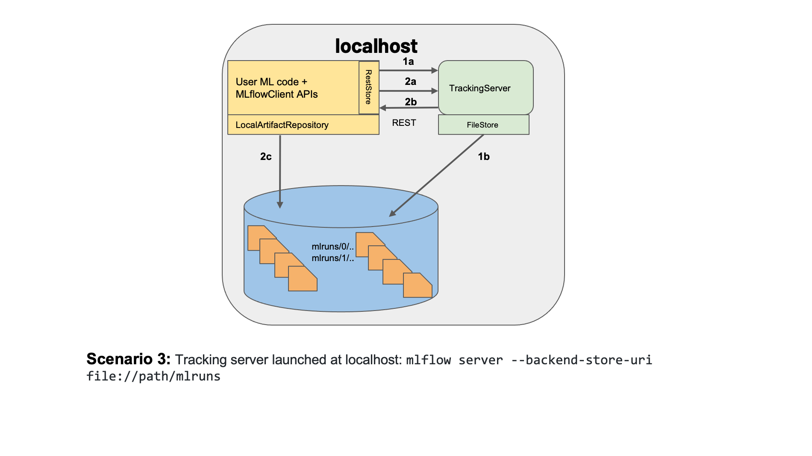

# MLflow

Presentation can be found here: https://docs.google.com/presentation/d/1NOuwkOMBxKz_CePfYCeVZ2zhq-MDPcQqCOKGzf9N06E/edit?usp=sharing

## Tracking server

To setup a tracking server we are using the architecture defined in this image via a singularity container, only difference is we use a database as the filestore



To run a tracking server which also provides a database, you can use the docker container provided [here](https://hub.docker.com/r/atcommons/mlflow-server)  

To build & run a singularity container using the docker image mentioned [here](https://hub.docker.com/r/atcommons/mlflow-server) on Theta GPU computes or Theta please refer to the code below

```bash
singularity build mlflow-server.sif docker://atcommons/mlflow-server
singularity exec --bind /home/atanikanti/mlflow-tutorial/artifacts:/mlflow mlflow-server.sif mlflow server --port 8080 --backend-store-uri sqlite:////mlflow/mlflow.db --default-artifact-root /home/atanikanti/mlflow-tutorial/artifacts
```

To access the server use port forwarding

```bash
ssh -L 8080:127.0.0.1:8080 <username>@theta.alcf.anl.gov
ssh -L 8080:127.0.0.1:8080 thetagpu16 
```

## MLflow Project

Aids in packaging multi step code and sharing with others to reproduce
mlflow run

```bash
mlflow run git@github.com:atanikan/mlflow-tutorial.git --env-manager=local
```

## MLflow Models

To save and server the model as a API


